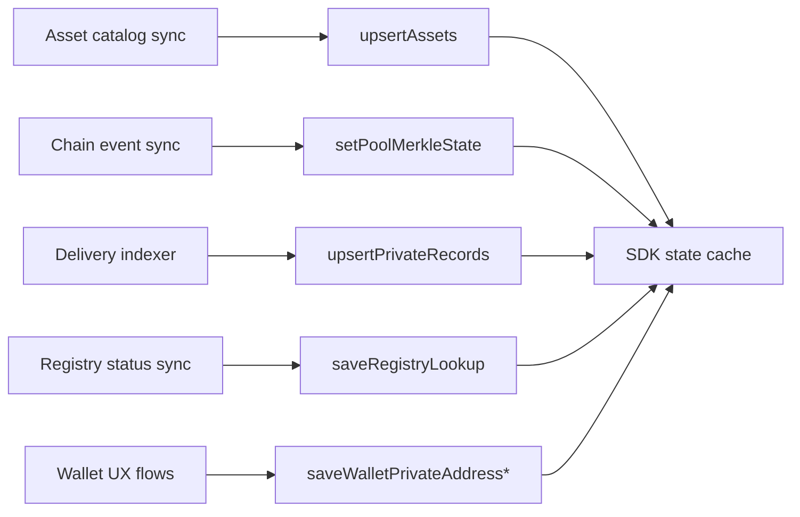

import { DataSourceLegend } from '../snippets/data-source-legend.jsx';

Load domain data from **trusted services** and **chain sync** in production. How-to pages seed state by hand so examples run in isolation.

<Warning>
  **Seed state** blocks in [Deposit](/application-development/how-to/deposit), [Withdraw](/application-development/how-to/withdraw), [Transfer](/application-development/how-to/transfer-registered-recipient), and [Unregistered transfer](/application-development/how-to/transfer-unregistered-recipient) are **documentation fixtures**. Do not ship them as user onboarding flows.
</Warning>

<DataSourceLegend />

## Production data flow

Write this data **before** users submit operations so prepare stays reliable.

## SDK method × typical source

| SDK write | Production source | Doc fixture |
| --- | --- | --- |
| `upsertAssets` | Your backend asset catalog | Hardcoded catalog row |
| `setPoolMerkleState` | Chain scanner or SDK sync after events | Static root and commitments |
| `upsertPrivateRecords` | Delivery polling / output-note decryption | Manual `coinNote` object |
| `saveRegistryLookup` | `checkRegistrationStatus` or registry poll | Hardcoded lookup row |
| `saveWalletPrivateAddressRecord` | Wallet private-address creation flow | Static `stpl1` address |
| `saveWalletPrivateAddressScalar` | Wallet signature during address setup | Static scalar hex |
| `setWalletDefaultPrivateAddressNonce` | Same wallet UX after the record/scalar exist | `{ owner, nonce: '1' }`. Spend prepare reads `$.wallet.defaultPrivateAddressNonce` — without this call it throws, it does not return `rejected`. |

## What runs automatically on execute

After a successful operation, the SDK updates local state without manual calls:

- mark spent records as consumed
- insert output and change records
- refresh pool commitment snapshot
- record delivery metadata when configured

Treat these updates as **SDK auto** — not fixtures and not backend-fed.

## Stellar production sources {#stellar-preset-examples}

| Data | Source |
| --- | --- |
| Asset rows | Asset catalog from your backend (includes `clientContract` and `poolContract` Soroban IDs) |
| Pool Merkle state | Pool event scanner or client sync against Soroban RPC |
| Private records | Incoming delivery sync and output-note handling in your payment app |
| Registry lookup | On-chain registry simulate + `checkRegistrationStatus` |
| Escrow note discovery | Blinded recipient tags + `fetchEscrowOutputNoteEvents` after the recipient registers |
| Audit interpretation | Encrypted audit event indexing and interpretation in your stack |

<Warning>
  How-to **Seed state** sections use example `G...` and `stpl1...` addresses and static hex commitments. Treat them as copy-paste fixtures for docs only.
</Warning>

### Production checklist

Before you go live, confirm:

1. Asset catalog synced from backend before showing balances
2. Pool Merkle state kept current via scanner or post-tx sync
3. Wallet private-address and scalar created through wallet UX, not hardcoded
4. Registry status fetched before registered-recipient transfers
5. Deliveries indexer populates `upsertPrivateRecords` for incoming notes
6. Environment variables set for pool, registry, application ID, audit public key, Relayer origin (if needed), and tag-issuance origin (if using escrow discovery)

## Where each config field comes from {#where-each-config-field-comes-from}

How to install and who issues these values: [Getting access](/integration/getting-access). Tutorial IDs in Quick start and how-to pages are **fixtures**. A live client must use the pool, registry, KYT, decimal application ID, and audit key of **your** stand or Compliance application. Values below can rotate:

| Field | Tutorial fixture | SDK `bindings:generate` | Stellar Pay testnet stand |
| --- | --- | --- | --- |
| Pool | `CBVQTSTSIJ4UZMN5FQBFHPUIYSW3ATGSP57BZDJNKTOBNQODQTRGE4K5` | `CD56SAQXVPM3MWTTNVDBDVUEQC6DPRIIYHP67C3ICH6JGMLJSWWUFUON` | `CA5VMH2O7ZVBNBMAMRO3INM5NSTRQYLJEKOC352OKGFNBU45Y3O7CNQ4` |
| Registry | `CCO5QRTS5HFVPR356FFC4NI62IMBQNDGMOAXR4K5UVTV3YMRWDZGKXGC` | `CCO5QRTS5HFVPR356FFC4NI62IMBQNDGMOAXR4K5UVTV3YMRWDZGKXGC` | `CCYTAXXIHB2PY2AY423LIE3YOGY5BJSDP2EGWF6SXV3KF52R4VJ5X7AV` |
| KYT registry | `CKYTEXAMPLECONTRACTIDAAAAAAAAAAAAAAAAAAAAAA` | — | `CCZSPXBKKQWYADKCULGLEXJGP7QFKFIULOPVDB7WFOQ76ESBON7LVVDU` |
| KYT API | `https://example.invalid` | — | `https://arcane-pay.testnet.arcane.finance/api` |
| Application ID | `1` (decimal fixture only) | — | `8925686221542498` |
| Audit public key | SDK bundled demo key in Quick start / Setup (valid format; not for production) | — | your application key from Compliance |
| `zkConfigNonce` | omit → SDK default **`3`** | — | `7` |
| Relay origin | unset → Relayer is never contacted | — | set on this stand (base URL from stand owner) |
| Tag issuance / storage origin | — | — | stand-supplied base URL for escrow discovery |
| `zkArtifactBaseUrl` | omit → SDK CDN default | — | stand may override (Pay points at a static CDN) |

`bindings:generate` IDs can diverge from the live Pay stand. Do not copy the Pay stand `zkConfigNonce=7` into a new integration unless that stand is the target. Escrow sends without `relayConfig.origin` fail (`escrow_relay_unconfigured`); they are not downgraded to Direct.

## Related

<CardGroup cols={2}>
  <Card title="Getting access" icon="key" href="/integration/getting-access">
    npm and stand values (not from a wallet).
  </Card>
  <Card title="Domain model" icon="sitemap" href="/concepts/domain-model">
    What each state entity represents.
  </Card>
  <Card title="Operations" icon="arrow-right-arrow-left" href="/concepts/operations">
    Which entities each operation consumes.
  </Card>
  <Card title="Deposit how-to" icon="book" href="/application-development/how-to/deposit">
    Fixture seed state example.
  </Card>
</CardGroup>
