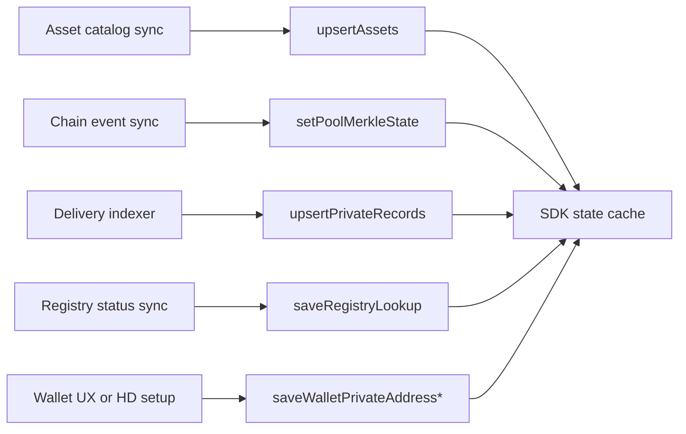

import { DataSourceLegend } from '../snippets/data-source-legend.jsx';

Load domain data from **trusted services** and **chain sync** in production. How-to pages seed state by hand so examples run in isolation.

<Warning>
  **Seed state** blocks in [Deposit](/application-development/how-to/deposit), [Withdraw](/application-development/how-to/withdraw), [Transfer](/application-development/how-to/transfer-registered-recipient), and [Unregistered transfer](/application-development/how-to/transfer-unregistered-recipient) are **documentation fixtures**. Do not ship them as user onboarding flows.
</Warning>

<DataSourceLegend />

## Production data flow

Write this data **before** users submit operations so prepare stays reliable.

## SDK method × typical source

| SDK write | Browser (frontend) | Node (backend) | Doc fixture |
| --- | --- | --- | --- |
| `upsertAssets` | Your backend asset catalog | Same catalog or env-driven row | Hardcoded catalog row |
| `setPoolMerkleState` | Client sync against Soroban RPC after events | Scanner or post-tx sync | Static root and commitments |
| `upsertPrivateRecords` | Delivery / output-note handling in the payment UI | Delivery remap onto HD account G-address | Manual `coinNote` object |
| `saveRegistryLookup` | `checkRegistrationStatus` or registry poll | Same on server | Hardcoded lookup row |
| `saveWalletPrivateAddressRecord` | Wallet private-address creation flow | Setup / register job after HD derive | Static `stpl1` address |
| `saveWalletPrivateAddressScalar` | Wallet signature during address setup | Scalar persisted with account (env secrets, not hardcoded) | Static scalar hex |
| `setWalletDefaultPrivateAddressNonce` | Same wallet UX after the record/scalar exist | Same after register | `{ owner, nonce: '1' }`. Spend prepare reads `$.wallet.defaultPrivateAddressNonce` — without this call it throws, it does not return `rejected`. |

## What runs automatically on execute

After a successful operation, the SDK updates local state without manual calls:

- mark spent records as consumed
- insert output and change records
- refresh pool commitment snapshot
- record delivery metadata when configured

Treat these updates as **SDK auto** — not fixtures and not backend-fed.

## Stellar production sources {#stellar-preset-examples}

| Data | Source |
| --- | --- |
| Asset rows | Asset catalog from your backend (includes `clientContract` and `poolContract` Soroban IDs) |
| Pool Merkle state | Pool event scanner or client sync against Soroban RPC |
| Private records | Incoming delivery sync and output-note handling in your payment app |
| Registry lookup | On-chain registry simulate + `checkRegistrationStatus` |
| Escrow note discovery | Blinded recipient tags + `fetchEscrowOutputNoteEvents` after the recipient registers |
| Audit interpretation | Encrypted audit event indexing and interpretation in your stack |

<Warning>
  How-to **Seed state** sections use example `G...` and `stpl1...` addresses and static hex commitments. Treat them as copy-paste fixtures for docs only.
</Warning>

### Production checklist

Before you go live, confirm:

1. Asset catalog synced before showing balances
2. Pool Merkle state kept current via scanner or post-tx sync
3. Wallet private-address and scalar created through wallet UX (browser) or HD register (Node) — not hardcoded
4. Registry status fetched before registered-recipient transfers
5. Deliveries path populates `upsertPrivateRecords` for incoming notes
6. Environment variables set for pool, registry, application ID, audit public key, Relayer origin (if needed), and tag-issuance origin (if using escrow discovery)

## Where each config field comes from {#where-each-config-field-comes-from}

How to install and who issues these values: [Getting access](/integration/getting-access). Tutorial IDs in how-to pages are **fixtures**. Runnable demos ship live stand rows in `.env.example`.

<Warning>
  The [frontend](/integration/quick-start) and [backend](/integration/quick-start) demos can share pool and registry while using **different** Compliance applications. Same pool does not mean same `applicationId`, audit key, KYT URL, or Relayer origin — copy env from the demo you run. Values below can rotate.
</Warning>

| Field | Tutorial fixture | Frontend demo (Pay stand) | Backend demo |
| --- | --- | --- | --- |
| Pool | `CBVQTSTSIJ4UZMN5FQBFHPUIYSW3ATGSP57BZDJNKTOBNQODQTRGE4K5` | `CA5VMH2O7ZVBNBMAMRO3INM5NSTRQYLJEKOC352OKGFNBU45Y3O7CNQ4` | `CA5VMH2O7ZVBNBMAMRO3INM5NSTRQYLJEKOC352OKGFNBU45Y3O7CNQ4` |
| Registry | `CCO5QRTS5HFVPR356FFC4NI62IMBQNDGMOAXR4K5UVTV3YMRWDZGKXGC` | `CCYTAXXIHB2PY2AY423LIE3YOGY5BJSDP2EGWF6SXV3KF52R4VJ5X7AV` | `CCYTAXXIHB2PY2AY423LIE3YOGY5BJSDP2EGWF6SXV3KF52R4VJ5X7AV` |
| KYT registry | `CKYTEXAMPLECONTRACTIDAAAAAAAAAAAAAAAAAAAAAA` | `CCZSPXBKKQWYADKCULGLEXJGP7QFKFIULOPVDB7WFOQ76ESBON7LVVDU` | `CCZSPXBKKQWYADKCULGLEXJGP7QFKFIULOPVDB7WFOQ76ESBON7LVVDU` |
| KYT API | `https://example.invalid` | `https://arcane-pay.testnet.arcane.finance/api` | `https://privacy-layer-staging-backend-gf66o.ondigitalocean.app/api` |
| Application ID | `1` (decimal fixture only) | `3722412212248783` | `845068536382695` |
| Audit public key | SDK bundled demo key (valid format; not for production) | Compliance app key in demo `.env.example` (`VITE_AUDIT_PUBLIC_KEY_HEX`) | Compliance app key in demo `.env.example` (`STELLAR_AUDIT_PUBLIC_KEY`) |
| `zkConfigNonce` | omit → SDK default **`3`** | `7` | `7` |
| Native SAC / token | fixture `clientContract` | `CDLZFC3SYJYDZT7K67VZ75HPJVIEUVNIXF47ZG2FB2RMQQVU2HHGCYSC` | `CDLZFC3SYJYDZT7K67VZ75HPJVIEUVNIXF47ZG2FB2RMQQVU2HHGCYSC` |
| Relay origin | unset → Relayer is never contacted | `https://arcane-pay.testnet.arcane.finance/api` | `https://relayer-svc-7ob84.ondigitalocean.app/api` (or local Relayer) |
| Tag issuance / storage origin | — | stand-supplied when using escrow discovery | stand-supplied when using escrow discovery |
| `zkArtifactBaseUrl` | omit → SDK CDN default | omit unless the stand overrides | omit unless the stand overrides |

Do not copy another stand’s `zkConfigNonce` into a new integration unless that stand is the target. Escrow sends without `relayConfig.origin` fail (`escrow_relay_unconfigured`); they are not downgraded to Direct.

Runnable paths: [Quick start](/integration/quick-start).

## Related

<CardGroup cols={2}>
  <Card title="Getting access" icon="key" href="/integration/getting-access">
    npm and stand values (not from a wallet).
  </Card>
  <Card title="Domain model" icon="sitemap" href="/concepts/domain-model">
    What each state entity represents.
  </Card>
  <Card title="Operations" icon="arrow-right-left" href="/concepts/operations">
    Which entities each operation consumes.
  </Card>
  <Card title="Deposit how-to" icon="book" href="/application-development/how-to/deposit">
    Fixture seed state example.
  </Card>
</CardGroup>
