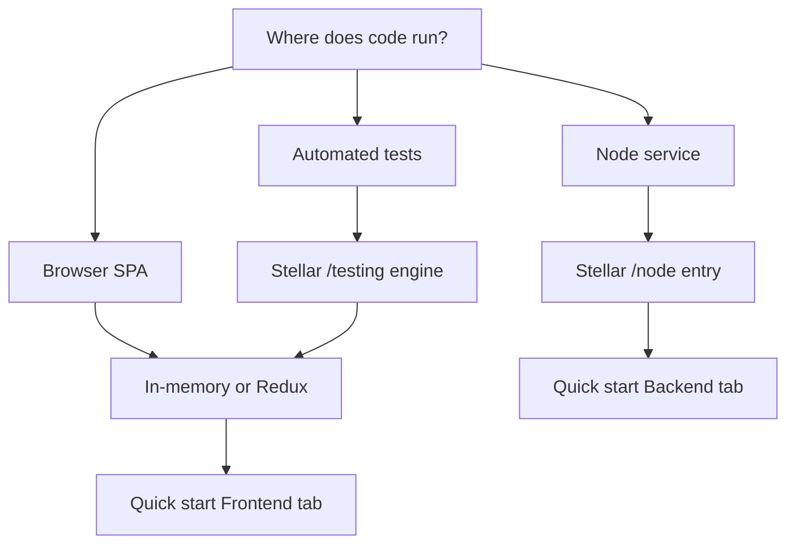

## Choose your runtime

| Runtime | Best for | State adapter | Quick start |
| --- | --- | --- | --- |
| **Browser SPA** | Wallet-connected payment UI | In-memory or Redux | [Quick start](/integration/quick-start) |
| **Node service** | Server-side signing or batch jobs | In-memory or custom persistence | [Quick start](/integration/quick-start) |
| **Automated tests** | Unit and integration tests | In-memory + Stellar testing helpers | — |



## Create a Stellar client

1. Install `@arcanetech/privacy-sdk-stellar` and a state adapter — see [Getting access](/integration/getting-access), [Quick start](/integration/quick-start), or [Install](/application-development/install). For private sender or escrow sends, also install [`@arcanetech/privacy-sdk-relay`](https://www.npmjs.com/package/@arcanetech/privacy-sdk-relay).
2. Load bundled SDK WASM with `loadDefaultStellarBrowserAssets()` (browser) or a filesystem WASM path via `@arcanetech/privacy-sdk-stellar/node`. Circuit artifacts resolve from the SDK defaults unless you pass a custom/dev scheme.
3. Implement a **Stellar wallet adapter** (`getAddress`, `authorizeMessage`, `signTransactionPayload`).
4. Pass **`transactEnvironment`** with Soroban RPC URL, pool/registry contract IDs, KYT config, and `signTransaction`.
5. Create the client once at app startup.

Runnable browser path: [Quick start](/integration/quick-start). React + Redux shell: [Setup](/application-development/setup).

## Node path {#node-path-stellar-preset}

Use `@arcanetech/privacy-sdk-stellar/node` when assets load from disk and a server-side wallet holds signing keys.

```ts
import { createStellarPrivacyClientFromNodeConfig } from '@arcanetech/privacy-sdk-stellar/node';
```

Supply filesystem paths for bundled runtime assets and the same network, wallet, and state adapters as the browser path.

Runnable Node path: [Quick start](/integration/quick-start).

## Test path

Use `@arcanetech/privacy-sdk-stellar/testing` to inject a **fake transact engine** and `@arcanetech/privacy-sdk-state-memory` for isolated state:

```ts
import { createFakeTransactEngine } from '@arcanetech/privacy-sdk-stellar/testing';
import { createInMemoryStateAdapter } from '@arcanetech/privacy-sdk-state-memory';
```

Tests can call `prepare` and `execute` without a live Soroban RPC endpoint.

## What you bring vs what the SDK brings

| You supply | SDK supplies |
| --- | --- |
| Network configuration (RPC, contracts, application ID) | Operation orchestration (prepare/execute) |
| Wallet adapter | Transaction preparation and submission |
| State adapter library | Domain state reads/writes during lifecycle |
| Protocol relay ports (transport, store, direct submit, finalize, drain, persist) | Relay admission, polling, retry, and fallback |
| Caller-supplied `submissionPath` on each private operation | `requiredSubmissionMethod(prepared, zkConfigNonce?)` |
| Audit public key and disclosure choices | Policy validation for supported routes |
| Backend-provided asset, delivery, and registry data (production) | Progress events and structured errors |
| Runtime assets loader (browser or Node) | Bundled assets in `@arcanetech/privacy-sdk-stellar` |

## Next

1. [Introduction](/overview/introduction) and [Packages](/overview/packages)
2. [Domain model](/concepts/domain-model) and [Operation lifecycle](/concepts/operation-lifecycle)
3. [Quick start](/integration/quick-start) — frontend or backend demo
4. [State integration](/integration/state-integration) and [Data sources](/integration/data-sources)
5. [Install](/application-development/install) for React package lines

## Related

<CardGroup cols={2}>
  <Card title="Quick start" icon="rocket" href="/integration/quick-start">
    Frontend or Backend demo tabs.
  </Card>
  <Card title="State integration" icon="database" href="/integration/state-integration">
    In-memory or Redux adapters.
  </Card>
  <Card title="Setup" icon="wrench" href="/application-development/setup">
    React + Redux client bootstrap.
  </Card>
</CardGroup>
