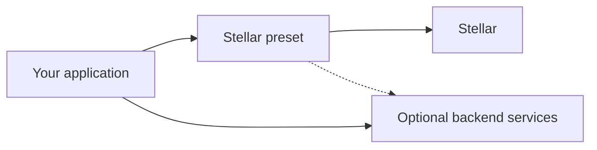
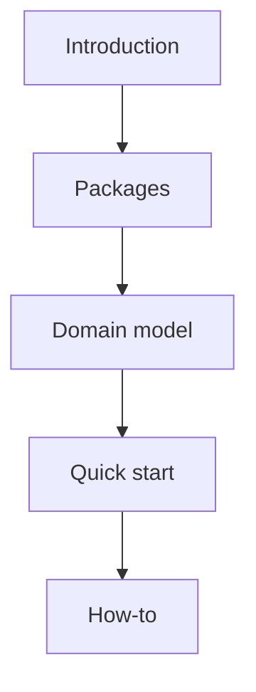

The Privacy Layer SDK is a TypeScript library for auditable private payments. Use `deposit`, `transfer`, and `withdraw` — the SDK prepares the transaction, drives wallet signing, and submits it.

## Packages

| Layer | Packages | Role |
| --- | --- | --- |
| **Core** | `@arcanetech/privacy-sdk-core` | Intents, operation lifecycle, errors, progress events |
| **Relay** | [`@arcanetech/privacy-sdk-relay`](https://www.npmjs.com/package/@arcanetech/privacy-sdk-relay) | Optional Protocol Relay runtime: admission, polling, retry, fallback |
| **State** | `@arcanetech/privacy-sdk-state-*` | Persistence for SDK domain state |
| **Network preset** | `@arcanetech/privacy-sdk-stellar` | Stellar contracts, wallet format, bundled runtime assets |

The SDK runs private transactions on the client and keeps a **local cache** of domain state (private records, pool snapshot, registry lookups, wallet keys). It does **not** replace your backend or indexer. Those services still supply asset catalogs, delivery indexing, and audit interpretation.

## What the SDK does

- **Prepare, then execute** — `prepare` validates and plans; `execute` signs, submits, and persists. The UI can show errors before the wallet prompt.
- **Typed errors** and **progress events** for loading states and retry logic.
- **State adapters** (in-memory, Redux) so you are not locked to one store.

## What you can build

- A Stellar wallet or payment client.
- Private transfers inside an existing Stellar dApp.
- A Node signing service (you supply a server-side wallet adapter).
- Tests with a fake transact engine — no live chain required.

## Next

1. **[Packages](/overview/packages)** — npm map and Stellar entry points.
2. **[Domain model](/concepts/domain-model)** — addresses, records, pool, and registry.
3. **[Getting access](/integration/getting-access)** — npm install and live stand values.
4. **[Quick start](/integration/quick-start)** — create a client and run a deposit.
5. **[Stellar application development](/application-development/install)** — React wiring and operation how-tos.

## Related

<CardGroup cols={2}>
  <Card title="Getting access" icon="key" href="/integration/getting-access">
    npm and where live stand values come from.
  </Card>
  <Card title="Packages" icon="cube" href="/overview/packages">
    Map of `@arcanetech/*` packages and the Stellar preset.
  </Card>
  <Card title="Quick start (Stellar preset)" icon="rocket" href="/integration/quick-start">
    Create a Stellar client and run a deposit.
  </Card>
  <Card title="Domain model" icon="sitemap" href="/concepts/domain-model">
    Addresses, records, pool, and registry.
  </Card>
</CardGroup>
