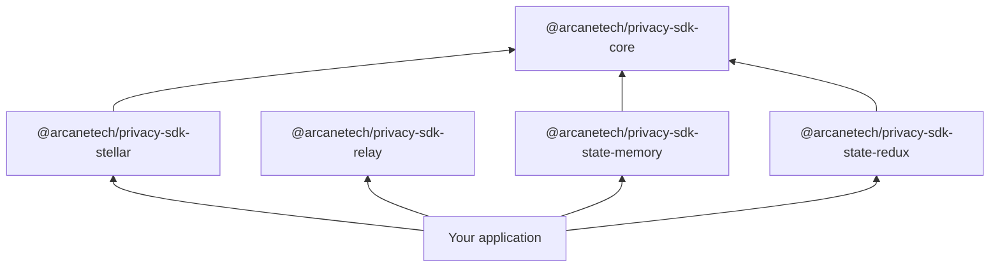
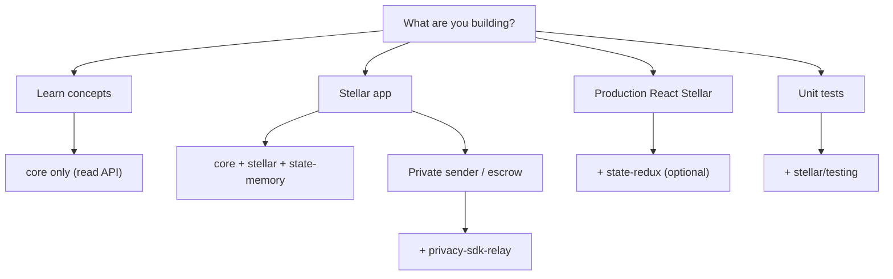

import { PackageMatrix } from '../snippets/package-matrix.jsx';

All public packages use the `@arcanetech` scope and are published on npm. Install the Stellar preset, a state adapter, and the optional Protocol Relay runtime explicitly. **No additional cryptography packages** are required for browser or Node.

## Package map

<PackageMatrix />

`@arcanetech/privacy-sdk-stellar` ships bundled runtime assets for browser and Node. Pass network configuration, a wallet adapter, a state adapter, and policy — the preset handles the rest. For private sender or escrow sends, add [`@arcanetech/privacy-sdk-relay`](https://www.npmjs.com/package/@arcanetech/privacy-sdk-relay) — see [Protocol Relay package](#protocol-relay).

## Layered architecture



- **Core** — intents, prepare/execute lifecycle, errors, progress events.
- **Relay** — Protocol Relay runtime: admission, polling, retry, and fallback over caller-supplied ports. It owns statuses, reason codes, and package JSON serialization, follows a caller-supplied submission path, and never inspects opaque package payloads or deposit amounts. Relaying is enabled only when the caller sets `relayConfig.origin`; otherwise the runtime Direct-submits and does not contact a relayer. Settlement polling is bounded. The package does not depend on Stellar or Soroban.
- **State adapters** — persistence for SDK domain state.
- **Network preset** — `@arcanetech/privacy-sdk-stellar`: client, contract bindings, and state schema extensions.

Internal transitive dependencies are not part of the public integration surface.

## Entry points and subpaths

**Shared packages:**

| Import | Purpose |
| --- | --- |
| `@arcanetech/privacy-sdk-core` | Intents, lifecycle helpers, error types, progress events |
| [`@arcanetech/privacy-sdk-relay`](https://www.npmjs.com/package/@arcanetech/privacy-sdk-relay) | Protocol relay runtime (ports, polling, retry, fallback) and the wire vocabulary (statuses, reason codes, package JSON) |
| `@arcanetech/privacy-sdk-state-memory` | In-memory state adapter for prototypes and tests |
| `@arcanetech/privacy-sdk-state-redux` | Redux Toolkit adapter for React apps |

**Stellar preset:**

| Import | Purpose |
| --- | --- |
| `@arcanetech/privacy-sdk-stellar` | Browser client factory and Stellar types |
| `@arcanetech/privacy-sdk-stellar/transact` | Stellar transaction helpers, including `requiredSubmissionMethod`, `buildBlindedRecipientTagChallengeMessage`, `fetchEscrowOutputNoteEvents`, and `unsignedEscrowAuthorizationForSweep` |
| `@arcanetech/privacy-sdk-stellar/node` | Node client with filesystem asset loading |
| `@arcanetech/privacy-sdk-stellar/testing` | Fake transact engine for unit tests |

## Stellar preset {#stellar-preset}

Use `@arcanetech/privacy-sdk-stellar` for **Stellar** with **Soroban** smart contracts:

- **Pool contract** — private deposits, transfers, and withdrawals.
- **Private-address registry** — maps public Stellar accounts to private payment addresses.
- **Soroban RPC** — submission and confirmation.
- **`createStellarPrivacyClient()`** — main browser entrypoint.
- **`requiredSubmissionMethod(prepared)`** — Direct Submission vs Protocol Relay for a prepared operation (positive public deposits stay direct; a zero public deposit uses relay). Escrow sends require relay and a zero public deposit; a positive public deposit is refused rather than downgraded. Escrow sweeps use Direct Submission so the claimant wallet signs the envelope.
- **`buildBlindedRecipientTagChallengeMessage(fields)`** — wallet-signed challenge string used to issue blinded recipient tags so a recipient can discover escrow notes after they register. See [Transfer to unregistered recipient](/application-development/how-to/transfer-unregistered-recipient#discover-notes-sent-before-registration).

**Address model:**

| Type | Format | Used for |
| --- | --- | --- |
| Public wallet | Stellar `G...` account | On-chain identity, public payouts |
| Private payment | `stpl1...` address | Pool notes and private sends |

**Bootstrap helpers:**

- `loadDefaultStellarBrowserAssets()` — bundled SDK WASM for the browser. Circuit schemes (2×2 and 6×6) are selected by `zkConfigNonce` (Commitment V2 by default).
- `transactEnvironment` — network, KYT, and transaction signing hooks passed at client creation.

For React wiring and operation examples, continue to [Stellar application development](/application-development/install).

## Protocol Relay package {#protocol-relay}

Install [`@arcanetech/privacy-sdk-relay`](https://www.npmjs.com/package/@arcanetech/privacy-sdk-relay) when the sender must stay private (zero public deposit) or you send to an unregistered recipient (escrow). Typical deposits keep the sender public and stay on Direct Submission — they do not need this package. The runtime does not depend on Stellar or Soroban.

```bash
npm install @arcanetech/privacy-sdk-relay
```

The package owns admission, lifecycle polling, retry, and consented Direct-submit fallback. Callers supply five required ports (`store`, `submitDirect`, `finalizeLocalState`, `drainDeliveries`, `persistUserTransaction`). Relaying is off until `relayConfig.origin` is set; an unset origin Direct-submits and never contacts a relayer. The runtime does not inspect opaque package payloads and has no Stellar, Soroban, or zero-knowledge dependencies.

Main exports: `createRelayApi`, `resolveRelayOrigin`, `submitAndAwaitPrivateOperation`, `throwIfRelayUnsuccessful`, `serializeRelayPackage` / `deserializeRelayPackage`, `resumePendingOperations`, `retryFailedRelayAttempt`.

See [Quick start — Protocol Relay](/integration/quick-start#step-6--protocol-relay-optional) to wire it after `requiredSubmissionMethod`.

## Which packages you need



## Related

<CardGroup cols={2}>
  <Card title="Getting access" icon="key" href="/integration/getting-access">
    npm install and where live stand values come from.
  </Card>
  <Card title="State integration" icon="database" href="/integration/state-integration">
    Choose in-memory or Redux state adapters.
  </Card>
  <Card title="Quick start (Stellar preset)" icon="rocket" href="/integration/quick-start">
    Create a Stellar client and run a deposit.
  </Card>
  <Card title="Install" icon="download" href="/application-development/install">
    Install the Stellar React stack.
  </Card>
</CardGroup>
